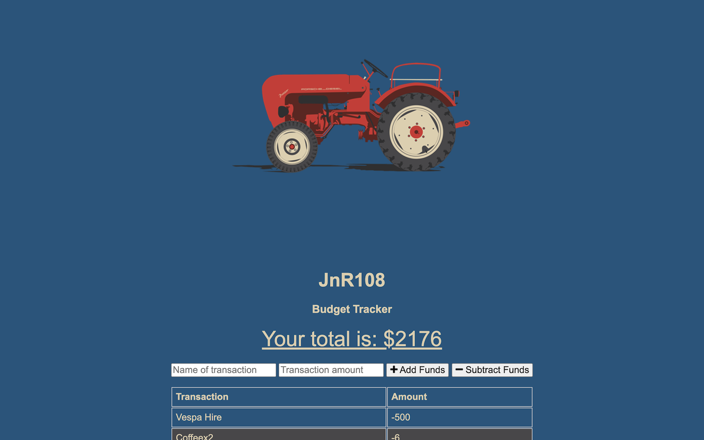
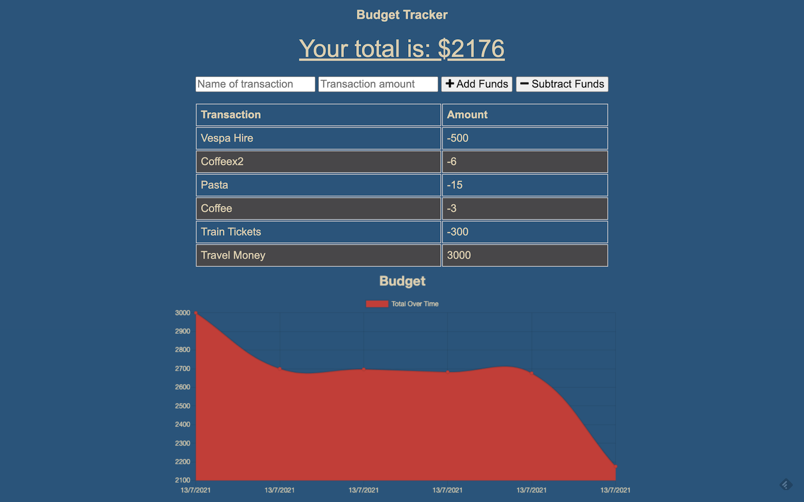

# JnR108

A Budget Tracker for when you're on the go!

## Deployment

JnR108 has been deployed on Heroku [https://sl-jnr108.herokuapp.com/](https://sl-jnr108.herokuapp.com/)

## Technologies

- Node.js using:
  - Express
  - Mongoose (MongoDB & Mongo Atlas)
  - IndexedDB
  - dotenv
  - Morgan

## Description

JnR108 is a budget tracker ('_tractor_') using MongoDB to store data, with fallback to IndexedDB should there be no internet access. It allows users to enter transactions adding and subtracting funds from their budget, allowing them to see a visual representation of their spending.

## What We Did

We were provided with a basic site, both front and back end, but with no data. We refactored the front end for user experience. We then implemented the ability for offline use by adding a webmanifest & service worker and IndexedDB for storing data whilst offline, and then adding offline data to the database when a connection is restored.

## Inspiration

We used implemented a favicon and the color styling inspired by this image: 1960 Porsche Junior Diesel Tractor Vector by artist [Caleb Brown](https://dribbble.com/browncd7).

